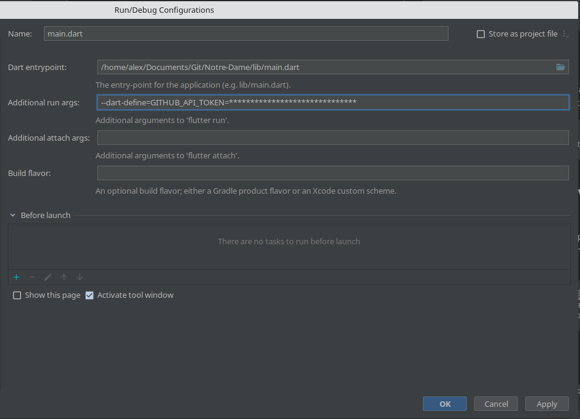

<div align="center">
  
  <p>
    <br /><strong>Notre-Dame Project</strong>
    <br />
    <a href="https://travis-ci.org/ApplETS/Notre-Dame" style="text-decoration: none;">
        
    </a>
    <br />
  </p>
</div>

This project is the placeholder for the fourth version of ÉTSMobile, a mobile which application that is currently available for Android and iOS. ÉTSMobile is the main gateway between the user and the [École de technologie supérieure (ÉTS)](https://www.etsmtl.ca/) on mobile devices. ÉTSMobile is an open-source project and is developped by members of the student club [ApplETS](https://clubapplets.ca/). It offers:

* Access to evaluation grades
* Access to the student's schedules
* And many more...

_Note: This guide is also available in: [Français](https://github.com/ApplETS/Notre-Dame/blob/master/README.fr.md)_

## Technologies used

* [Flutter](https://flutter.dev)

## Requirements

- Flutter SDK v2.0.0 or higher
- Openssl v1.1.1g or higher

## Before running the code

- To access some features you will need the SignetsAPI certificate, these files are encrypted. To decrypt them you will need to execute the `env_variables.sh` script (only available on the Google Drive of the club), then run:
```
chmod +x ./scripts/decrypt.sh
./scripts/decrypt.sh
```

## Run the code

- After cloning the repo, you will have to get the packages and generate the l10n classes. To do that run the following command:
```
flutter pub get
```

## Add environment variable for API_KEY
- To add the Google Maps API TOKEN, you need to rename the file **.env.template** into **.env**. In the **.env** file, you need to paste the Google Maps API TOKEN.
  

- In order to be able to run the app with the GitHub API token, you need to add an attribute when running the app. To do that run the following command:
```
flutter pub run --dart-define=SOME_VAR=SOME_VALUE
    # where SOME_VAR will be replaced with GITHUB_API_TOKEN
    # and SOME_VALUE will be the private token
```
You can add that command directly to your run configuration:
* Intellij: 

## Git hooks

You can find under the folder `.githooks` all the hooks needed for this project. To configure git to use this folder enter the following command:
```bash
git config core.hooksPath .githooks
```


## ⚖️ License
This projet is licensed under the Apache License V2.0. See the [LICENSE](https://github.com/ApplETS/Notre-Dame/blob/master/LICENSE) file for more info.
